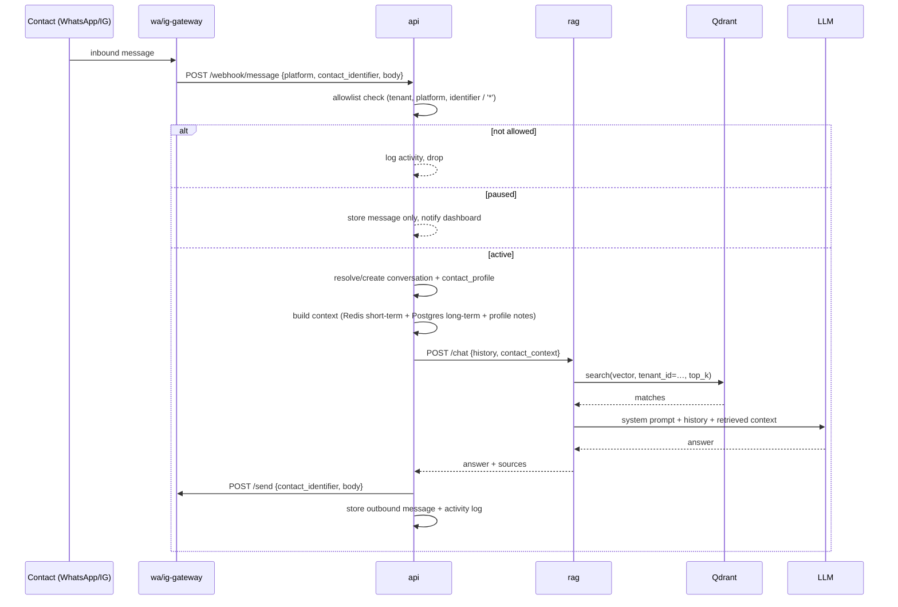

# rag_kro Architecture

This document explains how the pieces fit together, how a message flows end-to-end,
and why each boundary exists.

## 1. Services at a glance

```
                     ┌────────────────────────────┐
                     │  web (Next.js dashboard)   │  :3000  (only public port)
                     └─────────────┬──────────────┘
                                   │ /api/back/*, /api/wa/*, /api/ig/*, /api/ingest/*
         ┌─────────────┬───────────┼──────────┬──────────────┐
         ▼             ▼           ▼          ▼              ▼
┌────────────────┐ ┌────────┐ ┌──────────┐ ┌────────────┐ ┌───────────────┐
│ api :8000      │ │ rag    │ │ingestion │ │ wa-gateway │ │ ig-gateway    │
│ orchestration  │ │ :8002  │ │ :8001    │ │ :8100      │ │ :8200         │
│ webhooks,      │ │ RAG    │ │ CENTRAL  │ │ Baileys    │ │ instagrapi    │
│ allowlist,     │ │ chain  │ │ ingester │ │ WhatsApp   │ │ Instagram     │
│ pause/resume   │ └───┬────┘ └────┬─────┘ └─────┬──────┘ └───────┬───────┘
└───────┬────────┘     │           │             │                │
        │              │           │             │                │
   ┌────▼───┬────┬─────┴───┬───────┴───┐                       ───┘  inbound
   ▼        ▼    ▼         ▼           ▼                        messages
 postgres  redis qdrant    minio       ollama(optional)
```

- **`web`** — the only service bound to the host LAN (proxied API calls stay internal).
- **`api`** — business orchestration. Owns the allowlist, pause/resume, message store,
  identity resolution and notification side-effects.
- **`rag`** — retrieval + generation. Stateless, horizontally scalable; queries Qdrant
  using a `tenant_id` filter and calls the configured LLM.
- **`ingestion`** — the **centralized** knowledge pipeline. One deployment ingests for
  ALL tenants so no runtime duplicates embedding work.
- **`worker`** — Celery consumers + beat schedule: product/doc vector sync,
  contact summarization, reminders, notification forwarding.
- **`wa-gateway`** / **`ig-gateway`** — transport adapters. They speak WhatsApp/Instagram
  and translate everything into HTTP JSON handed to `api`.

## 2. Message flow (runtime)



Multi-platform context: because `conversations.resolved_contact_id` points at a shared
`contact_profiles` row, the context builder can pull history **across a WA conversation and
an IG conversation with the same real person** when identity resolution succeeds.

## 3. Data storage responsibilities

| Store | Role | Owned by |
|---|---|---|
| Postgres | source of truth: tenants, sessions, senders, conversations, messages, profiles, documents, products, orders, reminders, targets, activity_log | `api` + `worker` |
| Redis | short-term chat memory (`ctx:{conv_id}`), Celery broker/result, pause flags cache | `api`, `worker` |
| Qdrant | embeddings with `{tenant_id,type,doc_id,...}` payload filters | `ingestion` (writes), `rag` (reads) |
| MinIO | raw uploads (PDFs, images) so they can be re-processed or sent back | `ingestion` |
| Ollama | optional self-hosted LLM | n/a |

## 4. Centralized ingestion vs per-runtime ingestion

The spec explicitly wants the ingestion pipeline to **not** run per user instance. This
repo enforces that at the architecture level:

1. There is exactly **one** `ingestion` deployment, reachable internally.
2. Uploads land in **one** shared Qdrant collection; every vector carries `tenant_id`.
3. The worker runs hash-based change detection over `products`/`documents` and only
   replays diffs — there is no "ingest on every boot" path.
4. Runtime RAG only **reads** the shared index (`rag` has no write mount).

A tenant turning on a new instance inherits the same knowledge instantly — nothing to rebuild.

## 5. Identity resolution (cross-platform)

`safe by default`:

- If the incoming `(platform, identifier)` has an existing profile, reuse it.
- Auto-merge only when the *same identifier* exists on the other platform.
- Anything cleverer (name/phone overlap matching) is left to a manual "link contact"
  action in the dashboard to avoid leaking one contact's context into another's thread.

## 5b. Tenant isolation (defense in depth)

Layered so Company A's context can never surface in Company B's conversations:

1. **Payload filter (always).** Every Qdrant query filters `tenant_id`; every vector
   carries it. Retrieval is tenant-scoped by construction.
2. **Per-tenant API keys (on).** `X-Tenant-Id` + `X-Tenant-Key` enforced on every
   tenant-scoped `api` route; body `tenant_id` must match the authenticated header
   (`rag_kro_shared/tenant_auth.py`).
3. **Postgres RLS (opt-in).** `infra/postgres/rls/002_rls.sql` + `session_scope(tenant_id=)`
   make the DB itself refuse cross-tenant rows.
4. **Qdrant per-tenant collections (opt-in).** `QDRANT_PER_TENANT_COLLECTIONS=true` for
   physical vector-space separation.

Turn on 3+4 together when the second real tenant goes live (see `docs/SECURITY.md` §1b).

## 6. Async jobs (Celery/beat)

| Beat schedule | Task | Purpose |
|---|---|---|
| every 60s | `sync_products` | re-embed changed product rows (hash diff) |
| every 60m | `sync_documents` | mark straggler documents indexed |
| every 30m | `summarize_contacts` | compact recent chat into `contact_profiles.notes` |
| every 60s | `notify_reminders` | fire due reminders through the correct gateway |
| every 5m | `health_beat` | liveness marker in Redis for the admin panel |

## 7. Configuration & secrets

All services read the same `.env` via the shared `Settings` object
(`packages/python/rag_kro_shared/rag_kro_shared/config.py`). Session credentials
(WA/IG auth blobs) are encrypted at rest with a Fernet key from `FERENCE_SECRET_KEY`.

Internal HTTP calls are guarded by a shared `X-Internal-Key` header
(`INTERNAL_API_KEY`), never exposed to the public network.

## 8. Scaling notes

- `rag`, `api`, `worker` are stateless and can be replicated behind a load balancer.
- `wa-gateway` holds in-memory Baileys sockets; scale by assigning tenants to gateway
  instances (one process can hold many sockets; see SPEC open decision #3).
- Qdrant/Postgres/Redis/MinIO are the stateful core; put them on persistent volumes
  (already configured) and back them up.